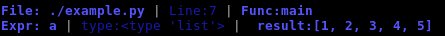
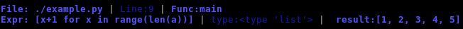
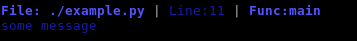
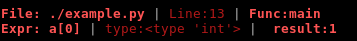

===========
debug_print
===========

This package comes from a basic idea that I have redone a couple of times originally in c and 
have dropped as a single .py(or .h) file in many of my projects. This can be used by dumping the folder
with your project or you can install it by running `pip install debug_print`.

While using debuggers/tests/a repl can be quite useful sometimes doing printf style debugging
also has its merits especially for short-lived programs.

The upside of this approach is that you don't have to repeat expressions or manually insert `__file__` and other
context hints. Also the distinctive names make it easy to search for debug lines and delete them(since this
package isn't really meant for production).


This package is in beta partially because I want to add some options but mostly since I still 
need to figure out what to do with logging.

ex

```python
import debug_print as d
a = [1,2,3,4,5]
d.debug_eval_print("a")
```

prints



or

```python
d.debug_eval_print("[x+1 for x in range(len(a))]")
```

which prints



prints result/value of the expression/variable(using eval, the reason
to use eval is so you can print out the variable name/expression
and what it evaluates to without specifying it twice) with line number, function name, type.
Soon it will print in color to stand out better.

```python
d.debug_message("some message")
```



just prints out a string(no eval) but with func name/line #/file

The calls to debug_eval_print or debug_message default to blue if you want
some of the expressions/messages to print in a different color just supply
a different colorscheme.

ex.

```python
  d.debug_eval_print("a[0]", colorscheme=d.ColorSchemes.FORE_RED)
```

prints



Some configuration(currently just which pieces of context info to include) can be configured by changing
`d.default_settings` dict. 

Note: Originally `debug_eval_print` was `debug_print` but I wanted to emphasize that it uses eval
under the covers even though it makes the name longer.